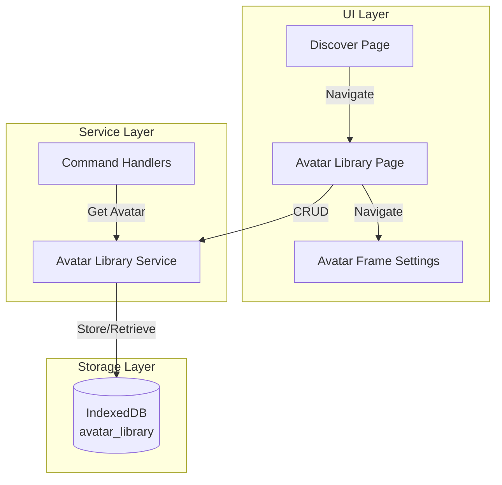

# Design Document: Avatar Library

## Overview

头像库功能将发现页面的"搜一搜"入口改造为头像管理功能。用户可以上传头像图片到独立的存储空间，AI角色可以从头像库中选择头像进行更换。此功能移除了AI生成头像的能力，改为从预上传的头像库中选择。

## Architecture



## Components and Interfaces

### 1. Avatar Library Service (`src/utils/avatarLibraryService.ts`)

负责头像库的CRUD操作，使用IndexedDB存储。

```typescript
interface AvatarItem {
  id: string           // 唯一标识符
  imageData: string    // base64图片数据
  createdAt: number    // 创建时间戳
  name?: string        // 可选的头像名称
}

// 核心接口
function initAvatarLibraryDB(): Promise<IDBDatabase>
function addAvatar(imageData: string, name?: string): Promise<string>
function getAvatars(): Promise<AvatarItem[]>
function getAvatarByIndex(index: number): Promise<AvatarItem | null>
function getAvatarCount(): Promise<number>
function deleteAvatar(id: string): Promise<void>
```

### 2. Avatar Library Page (`src/pages/AvatarLibrary.tsx`)

头像库管理页面，提供上传、查看、删除功能。

```typescript
interface AvatarLibraryProps {
  // 无需props，使用路由导航
}

// 页面功能
- 显示头像网格
- 上传新头像（压缩后存储）
- 删除头像（带确认）
- 导航到头像框设置
```

### 3. Modified Command Handler

修改 `commandHandlers.ts` 中的 `changeAvatarHandler`：

```typescript
// 移除: [换头像:生成:描述]
// 新增: [换头像:选择:序号]
// 保留: [换头像:用户头像]
// 保留: [换头像:图片:消息ID]
```

### 4. Modified Discover Page

更新 `Discover.tsx` 中的菜单项：

```typescript
{
  id: 32,
  name: '头像库',  // 原为 '搜一搜'
  icon: /* 头像图标 */,
  path: '/avatar-library',
  enabled: true  // 原为 false
}
```

## Data Models

### IndexedDB Schema

```
Database: kiro_avatar_library
Version: 1

Object Store: avatars
  - keyPath: id
  - indexes:
    - createdAt (for sorting)
```

### Avatar Item Structure

```typescript
{
  id: "avatar_1702345678901",
  imageData: "data:image/jpeg;base64,/9j/4AAQ...",
  createdAt: 1702345678901,
  name: "可爱猫咪"
}
```

## Correctness Properties

*A property is a characteristic or behavior that should hold true across all valid executions of a system-essentially, a formal statement about what the system should do. Properties serve as the bridge between human-readable specifications and machine-verifiable correctness guarantees.*

Based on the prework analysis, the following correctness properties have been identified:

### Property 1: Avatar Storage Round Trip
*For any* valid image data, storing it in the avatar library and then retrieving all avatars should include the stored image with matching data.
**Validates: Requirements 2.2, 2.3**

### Property 2: Avatar Deletion Consistency
*For any* avatar in the library, after deletion, the avatar should no longer appear in the list of all avatars.
**Validates: Requirements 3.2**

### Property 3: Avatar Selection by Index
*For any* valid index within the avatar library bounds, selecting that index should return the avatar at that position.
**Validates: Requirements 4.1, 4.2**

### Property 4: Generation Command Rejection
*For any* command matching the pattern [换头像:生成:*], the system should not process it as a valid avatar change command.
**Validates: Requirements 5.2**

## Error Handling

| Error Scenario | Handling Strategy |
|----------------|-------------------|
| IndexedDB not available | Fall back to localStorage with size warning |
| Image compression fails | Show error toast, don't save |
| Invalid avatar index | Return null, show system message to AI |
| Storage quota exceeded | Show warning, suggest deleting old avatars |

## Testing Strategy

### Unit Tests
- Test avatar service CRUD operations
- Test command handler pattern matching
- Test index bounds checking

### Property-Based Tests
Using fast-check library for property-based testing:

1. **Storage Round Trip Test**: Generate random image data strings, store them, verify retrieval
2. **Deletion Test**: Generate random avatars, delete one, verify it's gone
3. **Index Selection Test**: Generate random avatar lists, select by valid indices, verify correct avatar returned
4. **Command Rejection Test**: Generate random "生成" commands, verify they are rejected

### Integration Tests
- Test full flow: upload → display → select by AI → avatar updated
- Test navigation from Discover → Avatar Library → Frame Settings
