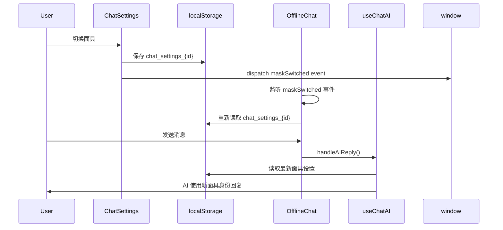

# Design Document: Offline Mask Sync

## Overview

修复线下模式（OfflineChat）在聊天设置中切换面具后不同步的问题。核心解决方案是在 OfflineChat 组件中添加对 `maskSwitched` 事件的监听，当事件触发时重新读取聊天设置。

## Architecture



## Components and Interfaces

### 1. OfflineChat.tsx 修改

添加 `maskSwitched` 事件监听器：

```typescript
// 监听面具切换事件
useEffect(() => {
  const handleMaskSwitched = () => {
    // 触发重新渲染，useChatAI 会在下次调用时读取最新设置
    console.log('[OfflineChat] 面具已切换，下次 AI 回复将使用新面具')
  }
  
  window.addEventListener('maskSwitched', handleMaskSwitched)
  return () => window.removeEventListener('maskSwitched', handleMaskSwitched)
}, [id])
```

### 2. 现有组件（无需修改）

- **ChatSettings.tsx**: 已正确保存面具设置并触发 `maskSwitched` 事件
- **useChatAI.ts**: 已在每次 `handleAIReply` 调用时从 localStorage 读取最新面具设置

## Data Models

无新增数据模型。使用现有的 `chat_settings_{id}` localStorage 结构：

```typescript
interface ChatSettingsData {
  useMask: boolean      // 是否使用面具
  maskId: string | null // 当前使用的面具ID
  // ... 其他设置
}
```

## Correctness Properties

*A property is a characteristic or behavior that should hold true across all valid executions of a system-essentially, a formal statement about what the system should do. Properties serve as the bridge between human-readable specifications and machine-verifiable correctness guarantees.*

Property 1: Mask sync after event
*For any* chat session with mask settings, when a maskSwitched event is dispatched, the next AI reply should use the mask settings from the latest localStorage state
**Validates: Requirements 1.1, 1.2, 2.2**

Property 2: Mask disable reverts to main identity
*For any* chat session where useMask is set to false, the AI should use the user's main identity (no mask info in prompt)
**Validates: Requirements 1.3**

Property 3: No reload required for mask changes
*For any* mask settings change, the new mask should be applied to the next AI message without requiring component remount or page reload
**Validates: Requirements 2.3**

## Error Handling

1. **localStorage 读取失败**: 使用默认设置（useMask: false, maskId: null）
2. **面具不存在**: 如果 maskId 对应的面具已被删除，回退到主身份
3. **事件监听器清理**: 在组件卸载时正确移除事件监听器，防止内存泄漏

## Testing Strategy

### Unit Tests
- 验证事件监听器正确添加和移除
- 验证 localStorage 读取逻辑

### Property-Based Tests
使用 fast-check 进行属性测试：
- 测试面具切换后 AI 回复使用正确的面具身份
- 测试禁用面具后回退到主身份
